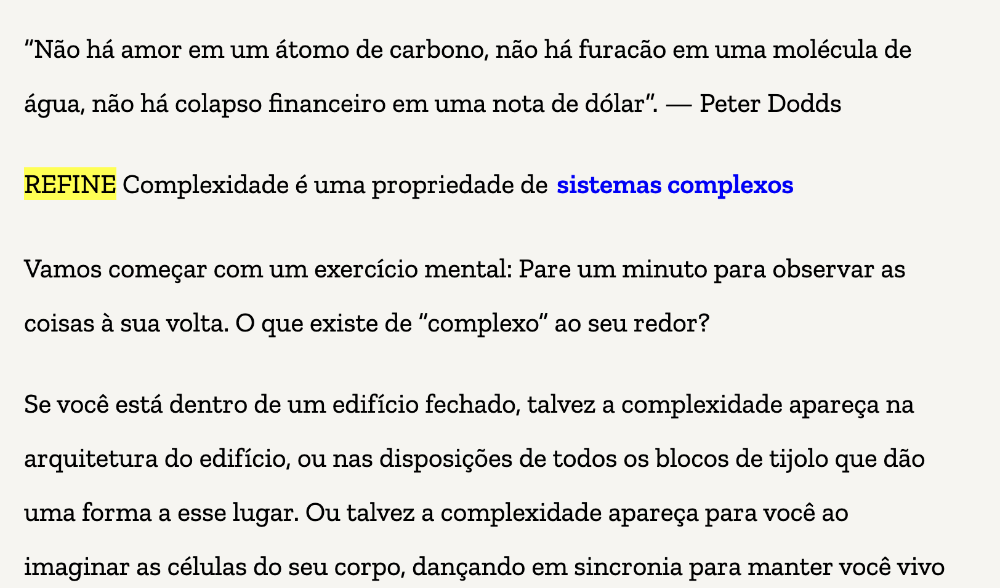
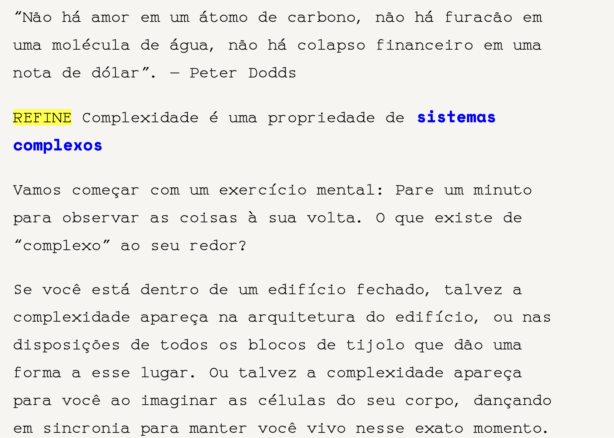

---
---

- [[todos]]
- **Testar fontes**
	- **Zilla Slab** (8/10)
	  collapsed:: true
		- 
	- **Space Mono** (6/10)
	  collapsed:: true
		- 
	- monospace
	- computer modern
	- Nunito
	- Source Sans Pro
	- Libre Franklin
	- Helvetica Neue
	- Inter var
	- Karla
- **Other**
	- TODO Reload graph after pressing reload
	- DONE Buy pensamentosistemico.com
	- TODO Criar perfil Instagram, TikTok, Youtube, Twitter
	- TODO Criar logo
- **Archive**
  collapsed:: true
	- DONE Exportar para netlify
	- DONE Experimentar Canela Text, fonte da Maggie Appleton
	- **Formatting**
		- DONE Remove bullet points
		- DONE Add line after each bullet point
		- DONE Support para Latex
		- DONE Parsing 
	- **Progress bar**
		- DONE Progress reflecting on nodes
		- DONE Cache pages visitadas
		- DONE Design progress bar
	- **Bug**
		- DONE Bug do grafo quebrado e repetido
		- DONE Bug de às vezes não contar o numero correto qd traversa uma pagina