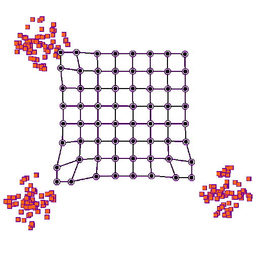

- > a capacidade de um sistema de se auto-organizar
- 
- A auto-organização é um fenômeno presente em diversos sistemas dinâmicos, que se caracteriza pela [[emergência]] de padrões e estruturas complexas a partir de interações simples entre os componentes do sistema. Isso ocorre sem a necessidade de intervenção externa ou de um controle centralizado, mas sim através de mecanismos de [[feedback]] e de auto-regulação interna.
- Um exemplo clássico de auto-organização é o comportamento de um enxame de abelhas, onde as indivíduos interagem entre si e com o meio ambiente de maneira a manter a colônia funcionando de maneira eficiente, sem que haja um líder ou um indivíduo responsável por dirigir as ações de todos os demais. Outro exemplo é o padrão de tráfego que emerge em uma cidade, onde os motoristas individuais tomam decisões baseadas nas condições do trânsito, mas acabam criando um fluxo coerente e organizado.
- A auto-organização também pode ser observada em sistemas físicos, como o movimento de partículas em uma solução ou o padrão de ondas em um sistema de ressonância. Ela também é importante em sistemas biológicos, como o crescimento e a diferenciação celular, ou em sistemas sociais, como o surgimento de novas ideias e tendências.
- A compreensão da auto-organização tem sido um tema de grande interesse para a ciência, pois ela pode nos ajudar a entender como os sistemas dinâmicos evoluem e se adaptam ao longo do tempo. Ela também tem sido aplicada em diversas áreas, como a engenharia, a economia e a biologia, para desenvolver modelos e sistemas mais eficientes e adaptáveis.