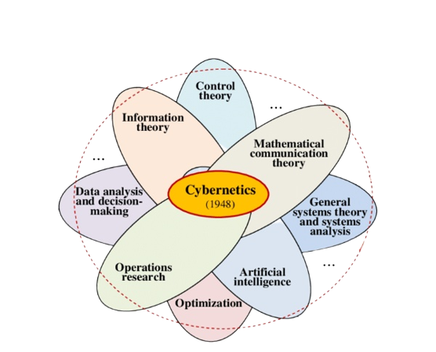

- > o campo transdisciplinar mais esquecido do mundo.
- 
- > 1) Um discurso da organização eficaz.
- > 2) A ciência da organização eficaz.
- > 3)  a ciência que estuda a comunicação e o controle nos sistemas vivos e mecânicos.
- > 4) a ciência da interconexão.
- >  5) a ciência que estuda os processos de interação e feedback entre sistemas complexos, sejam eles biológicos, sociais ou tecnológicos.
- > 6) a ciência que estuda os sistemas de informação e comunicação e sua aplicação na resolução de problemas práticos.
- **Conceitos criados—ou fortemente influenciados—pela história da cibernética:**
	- • [[feedback]]
	- • [[autopoiese]]
	- • [[complexidade]]
	- • [[informação]]
	- • [[lei da variedade requerida]]
	- • [[inteligência artificial]]
	- • [[sistema]]
	- • [[auto-organização]]
	- • [[pensamento sistêmico]]