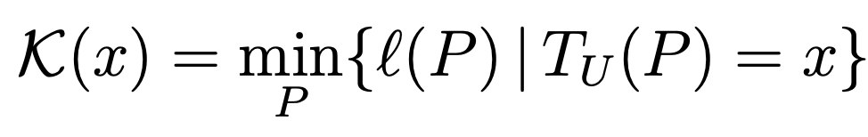

- Vamos começar com um exercício mental: Pare um minuto para observar as coisas à sua volta. O que existe de "complexo" ao seu redor?
- Se você está dentro de um edifício fechado, talvez a complexidade apareça na arquitetura do edifício, ou nas disposições de todos os blocos de tijolo que dão uma forma a esse lugar. Ou talvez a complexidade apareça para você ao imaginar as células do seu corpo, dançando em sincronia para manter você vivo nesse exato momento. Talvez a complexidade venha de imaginar a totalidade do planeta terra, e da quantidade de emoções e histórias que jorram a cada segundo de sua existência.
- **Que porra é complexidade?**
	- Complexidade existe em absolutamente em todo lugar do nosso universo. É uma daquelas coisas que apare mas que só aparecem a gente quando nós decidimos enxergar.
	- A má notícia é que complexidade é uma daquelas palavras simples e que muitas pessoas entendem, mas que ninguém consegue concordar numa definição única.
	- Na linguagem popular, dizer que algo é complexo é dizer que algo:
		- é complicado;
		  é difícil de ser entendido;
		  é díficil de ser recriado;
		  tem muitas partes
	- as definições acima, ainda que não sejam
	- Ainda que existam muitas definições do que é complexidade, eis aqui duas delas que julgo ser pertinente.
- **A definição Cibernética de complexidade**
	- Para o maravilhoso e esquecido campo da [[cibernética]], a definição é:
		- Complexidade é o grau de [[variedade]] de um [[sistema]].
	- Variedade é definida como o número total de possíveis estados de um [[sistema]]. Quanto mais estados um sistema é capaz de assumir, mais complexo o sistema é.
	- Por exemplo, pense que você e suas roupas são um sistema. Qual é a variedade do sistema?
	- A variedade do sistema aqui é o número total de todas as combinações de todas as roupas que você tem. Se você já estudou combinatória no ensino médio, você deve ter percebido que variedade é um conceito se parece bastante com o de [combinação](https://pt.wikipedia.org/wiki/Combina%C3%A7%C3%A3o).
	- Logo, se você tem só duas camisas, dois shorts e um chinelo, o seu sistema é relativamente simples. Porém, se você tiver tanta roupa ao ponto de conseguir encher uma loja inteira da da Renner, seu sistema passa a ser muito mais complexo.
	- Pense agora em exemplos de sistemas que possuem diferentes níveis de complexidade.
		- Qual é a variedade de seu corpo?
		  Qual é a variedade de um peixe?
		  Qual é a variedade do seu computador?
		  Qual é a variedade da nação brasileira?
- **A definição Matemática de complexidade**
	- Uma das primeiras definições formais e mais influentes do que é complexidade foi proposta há 60 anos atrás (ISSO FAZ MUITO POUCO TEMPO, BICHO). Essa definição foi dada por um matemático soviético, chamado [Andrey Kolmogorov](https://en.wikipedia.org/wiki/Andrey_Kolmogorov) e por isso tem o nome especial de [[Complexidade de kolmogorov]]. Essa definição é a seguinte:
		- {:height 66, :width 334}
	- O que esse troço assustador significa? Significa que:
		- A complexidade de alguma coisa é tamanho do processo mais curto que reconstrói essa coisa.
	- Vamos imaginar dois exemplos.
		- Imagine que você e seu primo estão fazendo uma brincadeira de adivinhar como o outro criou uma sequência de números. Na primeira rodada, seu primo te dá um papel contendo os seguintes números:
			- *0, 0, 0, 0, 0, 0, 0, 0, 0, 0, 0, 0, 0*
		- Então, ele te pergunta: "Me fala aí como você recriaria esses números"?
		- Você, então, não demora a trabalhar numa resposta. Passa a contar todos os zeros e então responde:
			- *"Eu escreveria 13 zeros seguidos!"*
		- Resposta correta.
		- Então, o seu primo decide aumentar um pouco a dificuldade do problema, e te dá uma sequência um pouco mais completa
			- *12, 12, 3, 32, 52, 9, 132, 212, 35, 552, 892, 145, 2332*
		- Novamente, ele te pergunta: "Me fala aí como você recriaria esses números"?
		- Você então pensa um pouco. Dessa vez a resposta não vem imediatamente. Você então pega um papel de rascunho e começa a tentar encontrar um padrão. Passado um certo tempo, você responde:
			- *"Eu iniciaria uma sequência com dois números uns. Depois, eu somaria os dois últimos números para formar o número seguinte. Eu pararia de escrever números quando escrevesse o 13º elemento. Assim, eu modificaria os números da sequência da seguinte forma: se o número é impar, eu multiplico ele por 10 e adiciono 2. Se ele é par, eu adiciono 1."*
		- Resposta correta.
	- Vamos ir um passo além e converter as suas duas respostas em texto binário. A razão para isso é que a complexidade de Kolmogorov foi definida pensando em algoritmos computacionais. E a gente sabe que todo algoritmo é compilado em números binários para o computador.
	- O computador veria na sua primeira resposta:
		- 01000101 01110101 00100000 01100101 01110011 01100011 01110010 01100101 01110110 01100101 01110010 01101001 01100001 00100000 00110001 00110011 00100000 01111010 01100101 01110010 01101111 01110011 00100000 01110011 01100101 01100111 01110101 01101001 01100100 01101111 01110011 00100001
	- E a segunda resposta seria:
		- 01000101 01110101 00100000 01101001 01101110 01101001 01100011 01101001 01100001 01110010 01101001 01100001 00100000 01110101 01101101 01100001 00100000 01110011 01100101 01110001 01110101 11000011 10101010 01101110 01100011 01101001 01100001 00100000 01100011 01101111 01101101 00100000 01100100 01101111 01101001 01110011 00100000 01101110 11000011 10111010 01101101 01100101 01110010 01101111 01110011 00100000 01110101 01101110 01110011 00101110 00100000 01000100 01100101 01110000 01101111 01101001 01110011 00101100 00100000 01100101 01110101 00100000 01110011 01101111 01101101 01100001 01110010 01101001 01100001 00100000 01101111 01110011 00100000 01100100 01101111 01101001 01110011 00100000 11000011 10111010 01101100 01110100 01101001 01101101 01101111 01110011 00100000 01101110 11000011 10111010 01101101 01100101 01110010 01101111 01110011 00100000 01110000 01100001 01110010 01100001 00100000 01100110 01101111 01110010 01101101 01100001 01110010 00100000 01101111 00100000 01101110 11000011 10111010 01101101 01100101 01110010 01101111 00100000 01110011 01100101 01100111 01110101 01101001 01101110 01110100 01100101 00101110 00100000 01000101 01110101 00100000 01110000 01100001 01110010 01100001 01110010 01101001 01100001 00100000 01100100 01100101 00100000 01100101 01110011 01100011 01110010 01100101 01110110 01100101 01110010 00100000 01101110 11000011 10111010 01101101 01100101 01110010 01101111 01110011 00100000 01110001 01110101 01100001 01101110 01100100 01101111 00100000 01100101 01110011 01100011 01110010 01100101 01110110 01100101 01110011 01110011 01100101 00100000 01101111 00100000 00110001 00110011 11000010 10111010 00100000 01100101 01101100 01100101 01101101 01100101 01101110 01110100 01101111 00101110 00100000 01000001 01110011 01110011 01101001 01101101 00101100 00100000 01100101 01110101 00100000 01101101 01101111 01100100 01101001 01100110 01101001 01100011 01100001 01110010 01101001 01100001 00100000 01101111 01110011 00100000 01101110 11000011 10111010 01101101 01100101 01110010 01101111 01110011 00100000 01100100 01100001 00100000 01110011 01100101 01110001 01110101 11000011 10101010 01101110 01100011 01101001 01100001 00100000 01100100 01100001 00100000 01110011 01100101 01100111 01110101 01101001 01101110 01110100 01100101 00100000 01100110 01101111 01110010 01101101 01100001 00111010 00100000 01110011 01100101 00100000 01101111 00100000 01101110 11000011 10111010 01101101 01100101 01110010 01101111 00100000 11000011 10101001 00100000 01101001 01101101 01110000 01100001 01110010 00101100 00100000 01100101 01110101 00100000 01101101 01110101 01101100 01110100 01101001 01110000 01101100 01101001 01100011 01101111 00100000 01100101 01101100 01100101 00100000 01110000 01101111 01110010 00100000 00110001 00110000 00100000 01100101 00100000 01100001 01100100 01101001 01100011 01101001 01101111 01101110 01101111 00100000 00110010 00101110 00100000 01010011 01100101 00100000 01100101 01101100 01100101 00100000 11000011 10101001 00100000 01110000 01100001 01110010 00101100 00100000 01100101 01110101 00100000 01100001 01100100 01101001 01100011 01101001 01101111 01101110 01101111 00100000 00110001 00101110
	- Nesse pequeno exercício mental, o seu primo te ofereceu duas sequências de diferentes complexidades. A "prova" de que uma sequência é menos complexa que a outra está no tamanho da sua descrição de como recriar a sequência de maneira exata. A gente
	- Agora, pense como essa definição de complexidade é generalizada para outras coisas:
		- Que passos você precisaria dar para recriar seu corpo?
		  Que passos você precisaria dar para recriar um peixe?
		  Que passos você precisaria dar para recriar o seu computador?
		  Que passos você precisaria dar para recriar a nação brasileira?
- **Questões interessantes**
	- [Qual é a diferença entre caos e complexidade?]([[Caos vs complexidade]])
	- Como lidar com complexidade?
	- Como sistemas ganham complexidade?
	-