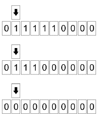

---
---

- > o nó do cérebro global.
- 
- Um computador é uma máquina eletrônica que é capaz de processar e armazenar grandes quantidades de [[informação]] de maneira rápida e precisa. Desde os primórdios da humanidade, as pessoas têm buscado maneiras de resolver problemas e facilitar suas vidas por meio da tecnologia. Pedrinhas eram usadas como uma forma primitiva de contagem e representação de números discretos, e esta ideia de unidade foi fundamental para o desenvolvimento da matemática e da tecnologia. A capacidade de contar e representar números de maneira precisa foi crucial para a criação de sistemas de medição e de processamento de dados, que são fundamentais para a operação de computadores.
- Os primeiros computadores foram criados no final do século 19 e início do século 20, e eram enormes máquinas que ocupavam salas inteiras. Eles eram usados principalmente para realizar cálculos matemáticos complexos e para armazenar grandes quantidades de dados. Nos anos 50, os primeiros computadores digitais foram criados, o que permitiu que eles fossem mais rápidos e precisos. Nos anos 60, os computadores passaram a ser usados para tarefas cotidianas, como processamento de dados e armazenamento de informações.
- Em 1936, Alan Turing propôs a "Máquina de Turing", que era um modelo teórico de computador capaz de executar qualquer tarefa computável. A Máquina de Turing foi a base para a criação dos primeiros computadores digitais e ainda é usada como referência para o design de computadores modernos.
- Computadores são basicamente uma fita de números binários que são manipuladas de determinada maneira através de instruções de programação. Os números binários são representados por "0"s e "1"s e são usados para representar qualquer tipo de informação, incluindo texto, imagens e áudio. A capacidade dos computadores de processar e armazenar grandes quantidades de informação de maneira rápida e precisa é o que os torna tão poderosos e versáteis.
- Outro grande contribuidor para o desenvolvimento dos computadores foi Claude Shannon, que revolucionou o campo com a ideia do "bit". Em 1948, Shannon propôs que qualquer [[informação]] poderia ser representada por uma sequência de bits, o que permitiu que os computadores fossem mais rápidos e precisos. A ideia do bit foi fundamental para o desenvolvimento da tecnologia de armazenamento de dados e da codificação de informações, e é a base para a operação de computadores modernos.
- Com o aumento da interconexão entre computadores ao redor do mundo, tem surgido a ideia do [[cérebro global]]. Este termo se refere a uma [propriedade emergente]([[emergência]]) do fluxo de informações em alta escala e alta aceleração que ocorre através da rede global de computadores.