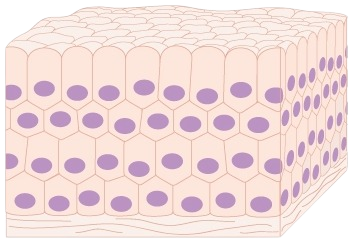

---
---

- > o todo é mais que a soma das partes.
- 
- Emergência é a ideia de que, quando componentes são agrupados de determinada forma, novas propriedades ou características podem surgir. Essas propriedades emergentes são resultado da interação entre os componentes do sistema, e podem ser difíceis de prever ou entender apenas observando os componentes por si só.
- Por exemplo, imagine um conjunto de átomos de hidrogênio e oxigênio, que, quando combinados, formam a molécula de água. A água possui propriedades que não são observadas nos átomos individuais, como a capacidade de dissolver outras substâncias e a mudança de estado (líquido para vapor) em determinadas condições de temperatura e pressão. Essas propriedades emergem da combinação dos átomos, e não são observadas nos átomos individuais.
- Na filosofia, a emergência é um assunto de debate há muito tempo. Alguns filósofos argumentam que as propriedades emergentes são completamente novas e independentes dos componentes que as compõem. Outros argumentam que as propriedades emergentes são apenas uma manifestação das propriedades dos componentes, e não são realmente novas. Ainda outros argumentam que as propriedades emergentes são intermediárias, sendo de alguma forma dependentes dos componentes, mas também possuindo algum grau de independência.
- Uma das principais questões filosóficas relacionadas à emergência é como explicar o surgimento de novas propriedades quando os componentes são agrupados de determinada maneira. Alguns filósofos defendem que essas propriedades emergem de uma espécie de "lei" que governa a combinação dos componentes, enquanto outros argumentam que essas propriedades são simplesmente resultados da interação entre os componentes.
- A emergência é um conceito importante em vários campos da ciência, incluindo a física, a biologia e a psicologia. Na física, por exemplo, a emergência é um fenômeno importante para compreender como as propriedades de um sistema emergem da combinação de seus componentes. Na biologia, a emergência é um conceito importante para compreender como as propriedades de um organismo emergem da combinação de suas células e tecidos. Na psicologia, a emergência é um conceito importante para compreender como as propriedades da mente emergem da combinação de processos nervosos.
- Além da filosofia e da ciência, a emergência também é um conceito importante em outras áreas, como a política e a economia. Em política, por exemplo, a emergência pode ser usada para entender como novas ideias ou movimentos surgem em uma sociedade. Na economia, a emergência pode ser usada para entender como novos mercados ou indústrias surgem em resposta às necessidades e desejos da sociedade.
- A emergência também tem sido um tema de debate em teorias da [[complexidade]], que são teorias que tentam explicar como os [[sistemas complexos]] se formam e como funcionam. Algumas teorias da complexidade argumentam que a emergência é um fenômeno fundamental na formação de sistemas complexos, enquanto outras argumentam que a emergência é apenas um resultado da interação de componentes simples.