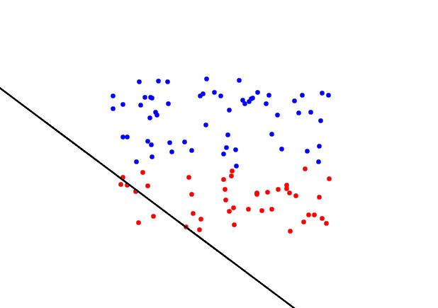

---
---

-
- > coisa superestimada.
- 
- Inteligência Artificial (IA) é um termo que se refere ao conjunto de técnicas e tecnologias que permitem a criação de [sistemas]([[sistema]]) capazes de realizar tarefas que normalmente exigem a intervenção humana. A IA é uma área da informática que tem como objetivo criar sistemas que sejam capazes de agir de forma autônoma, adaptando-se a novas situações e aprendendo com experiências passadas.
- Existem vários tipos de IA, incluindo:
	- **• IA Fraca ou Não-Geral**: são sistemas capazes de realizar tarefas específicas, mas que não são capazes de se adaptar a novas situações. Por exemplo, um programa de reconhecimento de voz pode ser capaz de converter fala em texto, mas não seria capaz de realizar outras tarefas que exijam inteligência.
	- **• IA Forte ou Geral:** são sistemas capazes de realizar qualquer tarefa que um ser humano seria capaz de realizar, incluindo adaptação a novas situações e aprendizado. Esta é a IA mais ambiciosa e ainda não foi alcançada, mas é o objetivo final da pesquisa em IA.
- A IA é criada através do uso de algoritmos de [[aprendizado de máquina]], que são capazes de processar grandes quantidades de [dados]([[dado]]) e aprender com eles. Os [algoritmos]([[algoritmo]]) de aprendizado de máquina são baseados em [[redes neurais]], que são estruturas que se inspiram no funcionamento do cérebro humano e são capazes de aprender com a experiência.