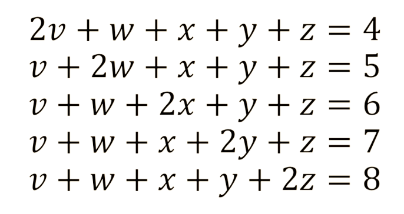

---
---

- > a gente só consegue segurar até 7 coisas na nossa cabeça ao mesmo tempo
- 
- A memória de trabalho pode ser pensada como um espaço de trabalho mental que nos permite manipular informações em tempo real. É um sistema que está constantemente ativo, mesmo quando não estamos conscientemente cientes disso. A memória de trabalho é usada para processar e armazenar informações relevantes para a tarefa em questão, como lembrar um número de telefone ou resolver um problema matemático complexo.
- Embora a capacidade exata da memória de trabalho varie de pessoa para pessoa, pesquisas mostraram que a pessoa média pode manter entre três a cinco itens em sua memória de trabalho ao mesmo tempo. Isso é comumente referido como o [Número mágico sete](https://en.wikipedia.org/wiki/The_Magical_Number_Seven,_Plus_or_Minus_Two) ou Lei de Miller.
- A capacidade limitada da memória de trabalho pode tornar desafiador completar tarefas complexas que exigem manter várias informações em nossas mentes. Por exemplo, ao resolver um problema matemático, podemos precisar manter vários números, símbolos e operações em nossa mente ao mesmo tempo. Isso pode ser difícil e os indivíduos podem precisar recorrer a estratégias como escrever as informações ou dividir o problema em partes menores e mais gerenciáveis.
- A capacidade limitada da memória de trabalho também foi mostrada como impactando nossa capacidade de aprender novas informações. Ao aprender um novo conceito ou habilidade, muitas vezes é necessário manter várias informações em nossas mentes simultaneamente. Isso pode ser particularmente desafiador para indivíduos com capacidade de memória de trabalho mais fraca, pois podem ter dificuldade em manter todas as informações relevantes.
- Formas de melhorar a memória de trabalho:
	- • **Agrupamento:** Agrupamento de informações em unidades menores e mais gerenciáveis. Isto pode facilitar a memória da informação e reduzir as demandas de memória de trabalho. Por exemplo, se você estiver tentando se lembrar de uma longa lista de números, você pode agrupá-los em pedaços menores de dois ou três dígitos.
	- • **Repetição:** Isso ajuda a transferir as informações para a [memória de longo prazo](http://augmentingcognition.com/). Por exemplo, se você estiver tentando se lembrar de um número de telefone, você pode repeti-lo para si mesmo várias vezes para ajudar a mantê-lo em sua memória de trabalho.
	- • **Visualização:** Criação de imagens mentais para ajudar a lembrar as informações. Por exemplo, se você estiver tentando se lembrar de uma lista de itens, você pode criar uma imagem mental de cada item a fim de ajudar a lembrá-lo.
	- • **Técnicas mnemônicas:** Uso de auxílios de memória, tais como acrônimos ou rimas, para ajudar a lembrar as informações. Por exemplo, você pode usar a sigla HOMES para lembrar os nomes dos Grandes Lagos (Huron, Ontário, Michigan, Erie, Superior).
	- • **Exercício:** Há algumas evidências que sugerem que o exercício pode melhorar a memória de trabalho. Exercício aeróbico, em particular, demonstrou ter um efeito positivo sobre a memória de trabalho.