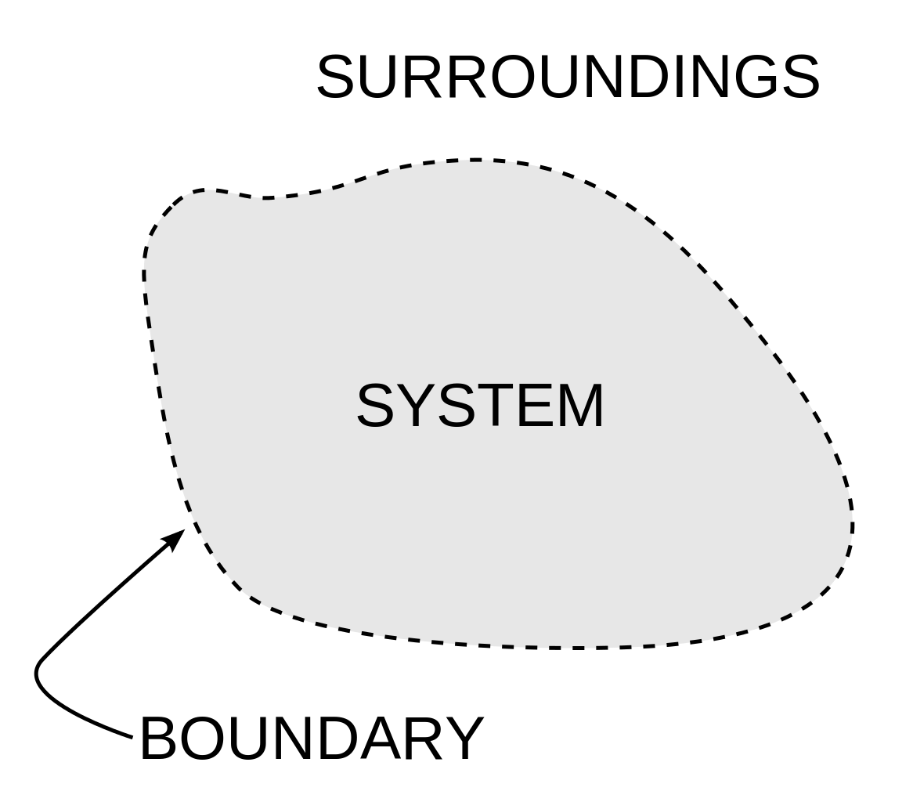

---
---

- > o observador sempre faz parte do sistema.
- {:height 416, :width 444}
- sim, existe uma realidade objetiva
	- mas não existem fronteiras objetivas.
- o observador é quem decide as fronteiras do sistema
	- esculpindo [sistemas]([[sistema]]) de ambientes.
- a [[cibernética]] é o único campo que internalizou essa ideia
	- e é por isso que a cibernética merece sobreviver.