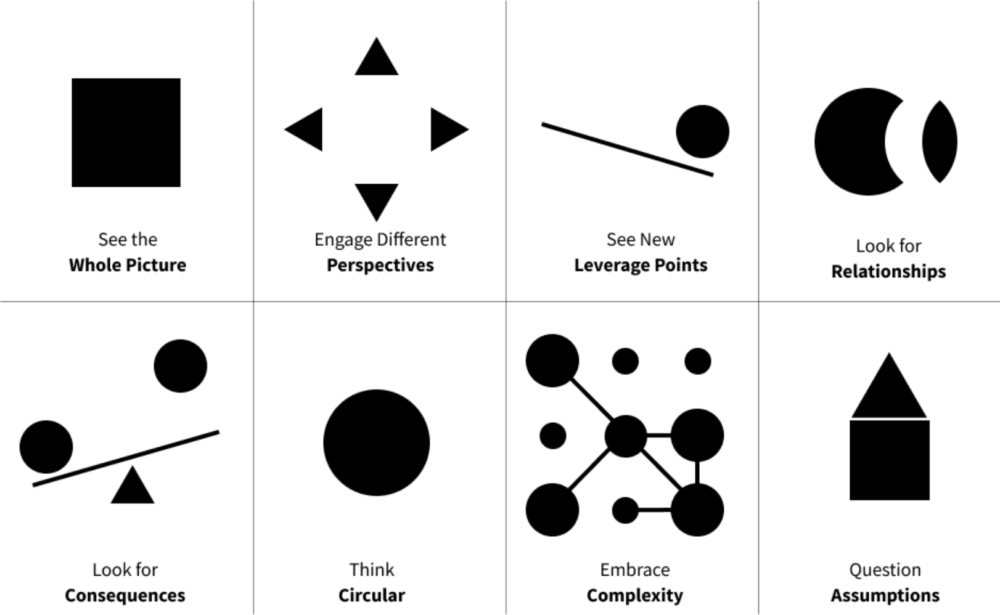

---
---

- > Pensar em partes individuais de um sistema muitas vezes é insuficiente para resolver problemas complexos.
- {:height 288, :width 455}
- O pensamento sistêmico é uma abordagem para entender e analisar o mundo ao nosso redor, que considera o todo e as relações entre os seus diversos elementos, em vez de focar apenas em partes isoladas. [Donella Meadows](https://pt.wikipedia.org/wiki/Donella_Meadows), autora e pesquisadora americana, foi uma das principais defensoras desta abordagem e escreveu extensivamente sobre o assunto.
- De acordo com Meadows, o pensamento sistêmico nos permite ver as coisas de maneira mais ampla e compreender como elas se relacionam entre si. Isso é especialmente importante quando se trata de problemas complexos e multidimensionais, como a mudança climática ou a pobreza global. Ao abordarmos esses problemas de uma perspectiva sistêmica, podemos identificar as interconexões entre os diferentes elementos do sistema e, assim, encontrar soluções mais eficazes.
- Para Meadows, o pensamento sistêmico também envolve a compreensão de que os sistemas são dinâmicos e estão em constante mudança. Isso significa que eles podem ser influenciados por fatores internos e externos, e que as ações que tomamos em um sistema podem ter consequências a longo prazo. Por exemplo, ao adotarmos uma medida para resolver um problema ambiental, podemos criar outros problemas em outras áreas. É importante, portanto, levar em consideração todas as possíveis consequências de nossas ações.
- Outra característica importante do pensamento sistêmico é a ideia de que os sistemas têm propriedades emergentes, ou seja, características que surgem quando os elementos do sistema interagem entre si de maneira complexa. Isso significa que um sistema pode ter comportamentos ou propriedades que não podem ser previstos ou explicados apenas pelo conhecimento dos elementos individuais que o compõem. Por exemplo, o comportamento de uma multidão pode ser difícil de prever, mesmo que conheçamos as intenções e comportamentos de cada indivíduo individualmente.
- O pensamento sistêmico também nos lembra de que os sistemas são compostos por sub-sistemas, que por sua vez são compostos por outros sub-sistemas. Isso nos ajuda a entender como os diferentes níveis de um sistema estão interconectados e como as ações em um nível podem afetar os outros. Além disso, o pensamento sistêmico nos incentiva a buscar soluções que sejam equilibradas e que levem em consideração o impacto em todos os níveis do sistema.
- Ao adotarmos uma abordagem sistêmica, podemos ter uma visão mais ampla e compreensiva dos problemas e desafios que enfrentamos, bem como encontrar soluções mais eficazes e duradouras. O pensamento sistêmico é, portanto, uma ferramenta importante para a tomada de decisões e para a resolução de problemas em diferentes áreas, incluindo a política, a economia, a saúde e o meio ambiente.