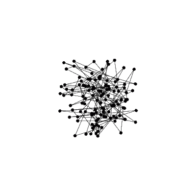

---
---

- > modelos inspirados no cérebro.
- {:height 408, :width 400}
- As redes neurais são um tipo de [[modelo]] de [[aprendizado de máquina]] que se inspira na forma como o cérebro humano processa [informações]([[informação]]). Elas consistem em uma série de camadas de nós interconectados, cada um responsável por realizar uma tarefa específica. Essas tarefas podem incluir a recepção de entrada, a combinação de informações e a produção de saída.
- As redes neurais são usadas para resolver uma variedade de problemas, incluindo a classificação de imagens, a tradução de idiomas e a previsão de resultados. Elas são especialmente úteis em situações em que os [dados]([[dado]]) são complexos ou não estruturados, pois podem aprender padrões e relações nos dados de maneira automática.
- Existem vários tipos diferentes de redes neurais, cada um adequado para diferentes tipos de problemas. As redes sem realimentação (*feedforward*) são as mais comuns e consistem em camadas sequenciais de nós, onde a saída de uma camada serve como entrada para a próxima. As redes neurais recorrentes (*recurrent*), por outro lado, possuem conexões de volta em si mesmas, o que permite que elas processem sequências de entrada, como palavras em um texto ou frames de um vídeo.
- Para treinar uma rede neural, é necessário fornecer exemplos de entrada e saída desejados, conhecidos como conjunto de treinamento. A rede usa esses exemplos para ajustar os pesos das conexões entre os nós de maneira a produzir saídas cada vez mais precisas para os exemplos de treinamento. Esse processo é conhecido como treinamento supervisionado, pois a rede é "supervisionada" pelas saídas corretas fornecidas no conjunto de treinamento.
- Uma vez treinada, a rede pode ser usada para fazer previsões para novos exemplos de entrada. Essas previsões são feitas pela propagação da entrada através da rede, com cada nó aplicando uma determinada função matemática às suas entradas e produzindo uma saída. A saída final da rede é então comparada com a saída desejada e uma medida de erro é calculada. Esse erro é usado para ajustar os pesos da rede durante o treinamento e buscar a minimização do erro.
- Existem várias maneiras de otimizar o treinamento de uma rede neural, com o uso de diferentes [algoritmos]([[algoritmo]]) de otimização, como o [método do gradiente](https://pt.wikipedia.org/wiki/M%C3%A9todo_do_gradiente), o método estocástico do gradiente e o [Adam](https://deepai.org/machine-learning-glossary-and-terms/adam-machine-learning#:~:text=Adam%20is%20an%20alternative%20optimization,than%20many%20other%20optimization%20programs.). Cada algoritmo tem suas próprias vantagens e desvantagens e pode ser mais adequado para determinados tipos de problemas.
- Outra consideração importante no treinamento de uma rede neural é o tamanho da rede e o número de camadas. Redes muito grandes ou com muitas camadas podem ser difíceis de treinar e podem sofrer de sobreajuste (*overfitting*), ou seja, performar bem no conjunto de treinamento mas mal em conjuntos de teste. Por outro lado, redes muito pequenas ou com poucas camadas podem não ter a capacidade de aprender os padrões complexos nos dados. Escolher o tamanho adequado da rede e o número de camadas pode ser um processo de tentativa e erro e pode exigir experimentação.
- As redes neurais têm sido aplicadas com sucesso em uma ampla variedade de problemas e têm se tornado cada vez mais populares nos últimos anos devido ao aumento da quantidade de dados disponíveis e às melhorias nas tecnologias de processamento de dados. No entanto, elas também têm algumas limitações, como a necessidade de grandes quantidades de dados para o treinamento e a falta de transparência em como as decisões são tomadas.