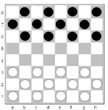

---
---

- > Um [[sistema]] autocontido, perfeitamente definido e finamente verificável
- 
-
- Um sistema formal é um conjunto de regras e símbolos que especificam uma série de operações ou procedimentos a serem executados em entradas específicas a fim de produzir uma saída bem definida.
- As três principais características de um sistema formal são:
	- • **Autocontido:** O sistema é completo em si mesmo, o que significa que todas as informações e regras necessárias estão incluídas dentro do sistema, e nenhuma informação externa é necessária para entendê-lo ou usá-lo.
	- • **Perfeitamente Definido**: O sistema é unívoco e não deixa espaço para interpretação. As operações e procedimentos são claramente definidos e entradas bem definidas produzem sempre a mesma saída.
	- •  **Finamente verificável:** O sistema pode ser verificado por um procedimento finito, o que significa que a validade da saída pode ser determinada em um período de tempo finito.
- Um exemplo de um sistema formal são damas. Como muitos sistemas formais, as damas têm regras que são autocontidas, o que significa que todas as informações necessárias estão incluídas dentro do jogo. Os movimentos e resultados do jogo são perfeitamente definidos, não deixando espaço para interpretação. Além disso, a validade de uma jogada pode ser verificada através de um procedimento finito.
- Como muitos sistemas formais, as damas podem ser instanciadas de muitas formas. Por exemplo, pode existir como um jogo de computador ou como um jogo físico com um tabuleiro e peças. Independentemente de sua forma física, as regras das damas permanecem as mesmas e continua sendo um sistema formal.