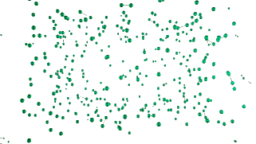

---
---

- > partes que se movem e conversam; padrões difíceis de entender.
- 
- Sistemas complexos estão em quase todos os lugares. Se eu te pedisse aqui para nomear ao menos três sistemas complexos que existem a sua volta agora, você certamente não acharia essa uma tarefa arduosa. Sistemas complexos aparecem em plantas, [computadores]([[computador]]), organizações coletivas, economias humanas, entre muitos outros exemplos.
- Aliás, não é loucura afirmar que você mesmo é um grande sistema complexo. Um sistema feito de 30 trilhões de células, trabalhando em conjunto sem parar para manter você vivo neste exato momento. Pare para observar quantos [eventos acontecem dentro do seu corpo a cada segundo](https://everysecond.io/your-body).
- É, tem muita coisa acontecendo o tempo todo. Mas há algo de estranho nisso tudo. Parece que a gente se esquece da [[complexidade]] das coisas a nossa volta ou pouco se importa em parar meditar sobre isso. E assim, levamos vidas diárias em que enxergamos árvores como somente folhas e troncos, pessoas como somente narrativas e memórias, e nações como somente recortes culturais e históricos. E tendo segmentado árvores, pessoas e nações nas partezinhas que nos interessam,
- Não, nós não podemos entender um sistema complexo segmentando ele de maneira arbitrária. Nós devemos admitir que vivemos mentiras. Nós sabemos pouco sobre árvores, pessoas e nações.
- Não meditamos o suficiente, nas questões:
	- Quais são todos os elementos que fazem esse sistema complexo existir?
	- De que maneira os elementos conversam entre si?
- No entanto, quando falamos em sistemas complexos, queremos dizer algo que vai além de "sistemas que possuem um alto grau de [[complexidade]]". Afinal, dependendo da definição de complexidade que você preferir, é possível argumentar que um sistema caótico é também um sistema complexo. Mas quando falamos em sistemas complexos, geralmente não falamos de sistemas caóticos.
- Quando usamos o termo "sistema complexo", geralmente queremos dizer a sistemas que além de possuírem um certo grau de complexidade, também possuem um alto grau de estrutura imbuídas em sua própria natureza.
- Vamos investigar algumas características de famosos sistemas complexos (informações inspiradas e sintetizadas de [*Complexity explained*](https://complexityexplained.github.io/) ).
- ## **Interações**
	- Sistemas complexos são muitas vezes feitos de várias partezinhas que "conversam" de várias maneiras diferente entre si e o ambiente. Essas partezinhas—ou **componentes**—formam uma [[rede]] de **interações**. Essas interações podem ser tão grandes que fica até difíceis de estudar cada partezinha de maneira isolada ou prever o seu futuro.
	- Pra complicar ainda mais, esses componentes podem ser outros sistema complexos totalmente novos, levando a um grande surubão de sistemas ou, mais educadamente, "sistemas de sistemas", que dependem um do outro para existir.
	- O principal desafio de quem tenta entender um sistema complexo não é apenas observar as partes que compõe esse sistema. Essa geralmente é a parte fácil. O difícil mesmo é entender como as interações das partezinhas dão origem ao sistema como um todo.
	- **Exemplos**:
		- bilhões de neurônios interagindo no cérebro humano
		- [computadores]([[computador]]) se comunicando na Internet
		- humanos em relacionamentos multifacetados.
- ## **Emergência**
	- *"O todo é maior do que a soma das partes"*
	- Em sistemas simples, você geralmente consegue entendê-los bem conhecendo seus componentes individualmente. Em sistemas complexos, porém, as propriedades do todo dificilmente podem ser compreendidas simplesmente conhecendo seus componentes por causa de algo chamado "emergência" (o ato de emergir; vir à tona).
	- Emergência é quando as interações das partes acabam gerando estruturas e comportamentos coletivos especiais em escalas maiores. O conceito de emergência é geralmente entendido com fato é normalmente resumido com duas frases:
		- *O todo é mais do que a soma de suas partes.*
		- *Onde se vê a árvore não se vê a floresta.*
	- **Exemplos**:
		- uma enorme quantidade de moléculas de ar e vapor formando um tornado;
		- múltiplas células formando um organismo vivo;
		- bilhões de neurônios em um cérebro produzindo consciência e inteligência.
- ## **Dinâmicas**
	- Os sistemas podem ser analisados em termos das mudanças de seus estados ao longo do tempo. Um estado é descrito em conjuntos de variáveis que melhor caracterizam o sistema. Como o sistema muda seu estado de um para o outro, suas variáveis também mudam, muitas vezes respondendo ao seu ambiente. Esta mudança é chamada linear se ela for diretamente proporcional ao tempo, ao estado atual do sistema, ou muda no ambiente, ou não linear se ela não for proporcional a elas. Sistemas complexos são tipicamente não lineares, mudando em diferentes taxas dependendo de seus estados e de seu ambiente. Eles também podem ter estados estáveis nos quais eles podem permanecer os mesmos mesmo se perturbados, ou estados instáveis nos quais os sistemas podem ser perturbados por uma pequena perturbação. Em alguns casos, pequenas mudanças ambientais podem mudar completamente o comportamento do sistema, conhecidas como bifurcações, transições de fase, ou pontos de ruptura. Alguns sistemas são caóticos, extremamente sensíveis a pequenas perturbações e imprevisíveis a longo prazo, mostrando o chamado efeito borboleta. Um sistema complexo também pode ser dependente do caminho, ou seja, seu estado futuro depende não apenas de seu estado atual, mas também de sua história passada.
	- **Exemplos**:
		- o clima muda constantemente de forma imprevisível;
		- a volatilidade financeira no mercado de ações.
	- Conceitos: Dinâmica, comportamento, não-linearidade, caos, não-equilíbrio, sensibilidade, efeito borboleta, bifurcação, não-previsibilidade a longo prazo, incerteza, dependência do caminho/contexto, não-ergodicidade.
- ## **Adaptação**
	- Sistemas complexos também podem se adaptar e evoluir ao longo do tempo para se adequar ao ambiente. Essa adaptação pode ser vista como uma forma de "aprendizado", onde o sistema é capaz de mudar sua estrutura ou comportamento de acordo com as condições externas.
	- A adaptação pode ser uma característica fundamental de sistemas complexos, pois pode permitir que eles se adaptem a mudanças no ambiente e sobrevivam em condições adversas.
	- **Exemplos**:
		- • uma planta se desenvolvendo para se adequar ao clima e solo em que está crescendo
		- • um animal adquirindo novas habilidades para se alimentar ou se defender de predadores
		- • uma sociedade humana mudando suas leis e práticas para se adequar a novas circunstâncias.
- ## **Interdisciplinaridade**
	- Estudar sistemas complexos geralmente envolve uma abordagem interdisciplinar, pois muitas vezes é necessário conhecimento de várias áreas diferentes para compreender o sistema em questão. Isso inclui ciências naturais, ciências sociais, matemática, física, engenharia, entre outras.
	- A interdisciplinaridade é importante porque muitas vezes é difícil compreender um sistema complexo usando apenas um conjunto de ferramentas ou perspectivas. Em vez disso, é necessário usar uma variedade de métodos e ferramentas para entender os diferentes aspectos do sistema.
	- **Exemplos**:
		- • estudar o sistema imunológico pode envolver biologia, química, física e matemática
		- • estudar o clima pode envolver meteorologia, oceanografia, geologia e física
		- • estudar uma sociedade pode envolver antropologia, sociologia, política, psicologia e outras disciplinas.
- ## **Métodos**
	- Há vários métodos usados para estudar sistemas complexos, incluindo simulação computacional, modelagem matemática, análise de redes, entre outros.
	- O método escolhido dependerá do sistema em questão e do objetivo do estudo. Por exemplo, a simulação computacional pode ser útil para prever o comportamento futuro de um sistema com base em dados históricos, enquanto a modelagem matemática pode ser útil para entender como diferentes variáveis afetam o comportamento do sistema. A análise de redes pode ser útil para visualizar e analisar as interações entre os componentes de um sistema.